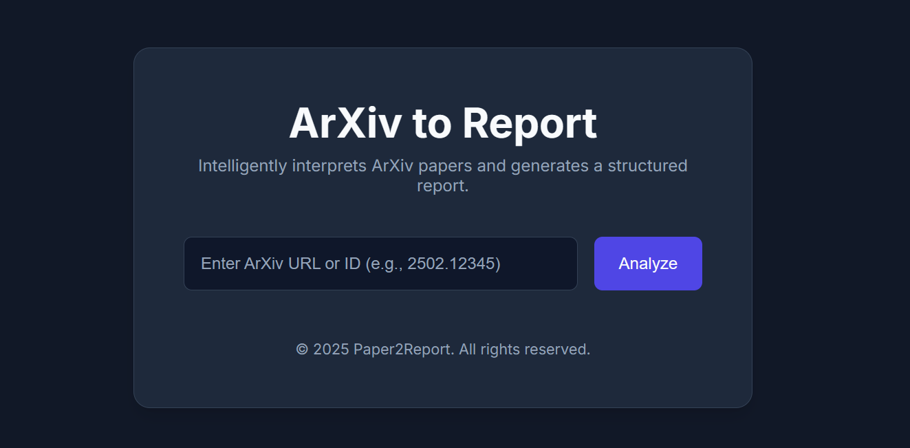

# ArXiv to Report

ArXiv to Report is a web application that intelligently interprets academic papers from ArXiv. Simply provide an ArXiv URL or paper ID, and the system will process the paper's PDF, generate a structured markdown report, extract illustrations, and package everything into a convenient zip file for download.



## Features

-   **Multiple URL Formats**: Accepts ArXiv ID, abstract URLs (`/abs/...`), and direct PDF URLs (`/pdf/...`).
-   **Structured Analysis**: Leverages a Large Language Model (LLM) to generate a comprehensive and structured report in markdown format.
-   **Figure Extraction**: Automatically identifies and extracts figures and diagrams from the PDF document.
-   **Convenient Packaging**: Bundles the generated report and all extracted figures into a single, downloadable `.zip` file.
-   **Modern Web Interface**: A clean, modern, and responsive single-page application for a smooth user experience.
-   **Configurable**: Frontend and backend configurations are separated for easy setup and deployment.

## Architecture

The application is built with a decoupled frontend and backend architecture:

-   **Backend**: A powerful FastAPI application built in Python that serves a single, robust `/analyze` endpoint. It handles all the heavy lifting: PDF downloading, text and figure extraction, and AI-powered analysis.
-   **Frontend**: A lightweight, vanilla JavaScript single-page application (SPA) that provides a user-friendly interface. It communicates with the backend API, handles user input, and manages the download process.

## Technology Stack

-   **Backend**:
    -   Python 3.9+
    -   FastAPI: For the high-performance API.
    -   Uvicorn: As the ASGI server.
    -   PyMuPDF: For robust PDF parsing and figure extraction.
    -   OpenCV: For image processing and manipulation.
    -   `pydantic-ai`: For interacting with the language model.
-   **Frontend**:
    -   HTML5
    -   CSS3
    -   Vanilla JavaScript (ES6+)

## Prerequisites

-   Python 3.9 or newer.
-   An API key for an OpenAI-compatible service (e.g., OpenAI, Groq, or a self-hosted model endpoint).

## Installation

First, clone the repository to your local machine:

```bash
git clone <your-repository-url>
cd arxiv2report
```

### Backend Setup

1.  **Create and activate a Python virtual environment:**

    ```bash
    python3 -m venv .venv
    source .venv/bin/activate
    ```

2.  **Install the required dependencies:**

    ```bash
    pip install -r requirements.txt
    ```

3.  **Configure your API key:**
    Create a file named `.env` in the project root directory and add your API credentials. This file is used to securely load your keys without hard-coding them.

    ```.env
    OPENAI_API_KEY="your-api-key-here"
    OPENAI_API_BASE="https://your-api-base-url.com/v1"
    ```

    *Note: `OPENAI_API_BASE` should point to the base URL of your chosen AI provider.*

### Frontend Setup

The frontend does not require an installation step, but you need to ensure its configuration points to the running backend.

## Configuration

### Backend

The backend is configured via the `.env` file as described in the installation steps.

### Frontend

The frontend is configured via the `frontend/config.js` file. You can edit this file to change the location of the backend API.

```javascript
// frontend/config.js
const FRONTEND_CONFIG = {
    API_BASE_URL: 'http://127.0.0.1:8000'
};
```

## Running the Application

To run the application, you need to start both the backend and the frontend servers in separate terminals.

### 1. Start the Backend

In your first terminal, from the project root directory (`/home/vlln/arxiv2report`):

```bash
# Make sure your virtual environment is activated
source .venv/bin/activate

# Start the FastAPI server
uvicorn src.arxiv2report.__main__:app --host 0.0.0.0 --port 8000
```

The backend API will now be running on `http://127.0.0.1:8000`.

### 2. Start the Frontend

Open a second terminal:

```bash
# Navigate to the frontend directory
cd frontend

# Start a simple Python web server
# You can change the port number if needed
python -m http.server 8080
```

### 3. Access the Application

Open your web browser and navigate to:

**http://127.0.0.1:8080**

You can now use the application to analyze ArXiv papers.
